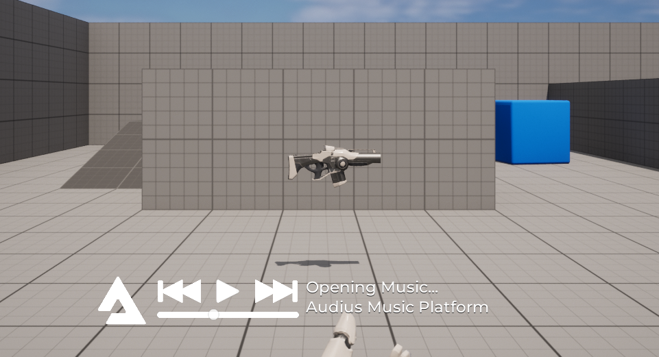
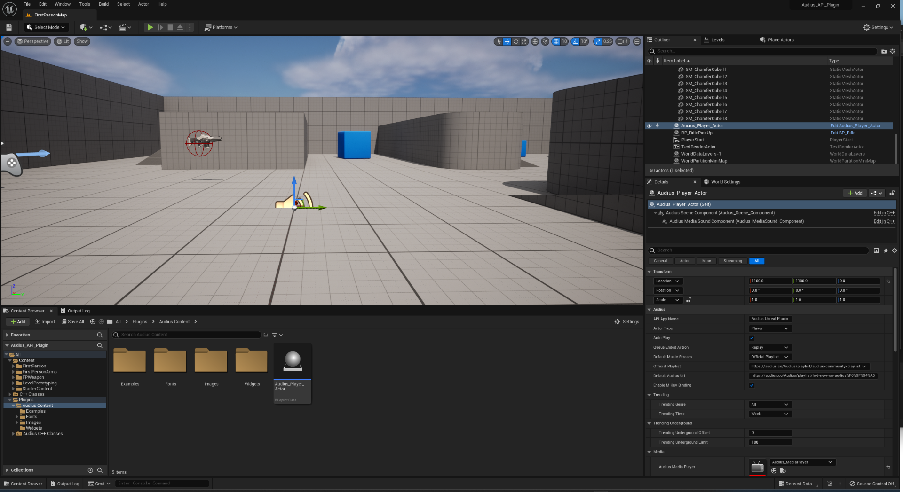

# Audius Unreal Engine Plugin


The Audius API is entirely free to use. Audius asks that you adhere to the guidelines in this doc [https://audiusproject.github.io/api-docs/#audius-api-docs](https://audiusproject.github.io/api-docs/#audius-api-docs) and always credit artists.

## Supported Engine Versions

5.0, 5.1, 5.2, 5.3, 5.4

## Install via the Unreal Marketplace

[https://www.unrealengine.com/marketplace/en-US/product/audius-music](https://www.unrealengine.com/marketplace/en-US/product/audius-music) ** 5.2, 5.3, 5.4

## Manual Install 

1. Download "Audius.zip" for your Unreal Engine version from https://github.com/DigiKrafting/Audius_Unreal_Plugin/releases
2. Unzip and copy the "Audius" folder to your project's "Plugins" folder, if you don't have one create one.
3. Add to plugins via the Unreal Editor Menu [Edit->Plugins]

## Marketplace Version Demos
	
	The demos are just the First Person template with the [Audius Plugin] enabled and the [Audius_Player_Actor] in the level.

	[https://github.com/DigiKrafting/Audius_Unreal_Plugin/archive/refs/tags/ue5.2_demo.zip](https://github.com/DigiKrafting/Audius_Unreal_Plugin/archive/refs/tags/ue5.2_demo.zip)
	[https://github.com/DigiKrafting/Audius_Unreal_Plugin/archive/refs/tags/ue5.3_demo.zip](https://github.com/DigiKrafting/Audius_Unreal_Plugin/archive/refs/tags/ue5.3_demo.zip)
	[https://github.com/DigiKrafting/Audius_Unreal_Plugin/archive/refs/tags/ue5.4_demo.zip](https://github.com/DigiKrafting/Audius_Unreal_Plugin/archive/refs/tags/ue5.4_demo.zip)

## Source Downloads

[https://github.com/DigiKrafting/Audius_Unreal_Plugin/releases](https://github.com/DigiKrafting/Audius_Unreal_Plugin/releases)

## Branches

* 5.0
  
	[https://github.com/DigiKrafting/Audius_Unreal_Plugin/tree/5.0_Audius_Plugin](https://github.com/DigiKrafting/Audius_Unreal_Plugin/tree/5.0_Audius_Plugin)\
	
* 5.1 

	[https://github.com/DigiKrafting/Audius_Unreal_Plugin/tree/5.1_Audius_Plugin](https://github.com/DigiKrafting/Audius_Unreal_Plugin/tree/5.1_Audius_Plugin)

* 5.2

	[https://github.com/DigiKrafting/Audius_Unreal_Plugin/tree/5.2_Audius_Plugin](https://github.com/DigiKrafting/Audius_Unreal_Plugin/tree/5.2_Audius_Plugin)

* 5.3

	[https://github.com/DigiKrafting/Audius_Unreal_Plugin/tree/5.3_Audius_Plugin](https://github.com/DigiKrafting/Audius_Unreal_Plugin/tree/5.3_Audius_Plugin)

* 5.4

	[https://github.com/DigiKrafting/Audius_Unreal_Plugin/tree/5.4_Audius_Plugin](https://github.com/DigiKrafting/Audius_Unreal_Plugin/tree/5.4_Audius_Plugin)



## Usage

1. Enable the plugin in the Unreal Editor via [Edit->Plugins]
2. Drag the [Audius_Player_Actor] into your level and configure options.



## C++ Usage

Add "Audius" to the PublicDependencyModuleNames in your *project*.Build.cs

```
PublicDependencyModuleNames.AddRange(new string[] {
    "Core",
    "CoreUObject",
    "Engine",
    "InputCore",
    "HeadMountedDisplay",
    "GameplayTags",
    "Audius"
});
```

```
#include "Audius_Actor_Base.h"
#include "Kismet/GameplayStatics.h" 
```

```
FTransform Audius_Actor_SpawnTransform(FRotator::ZeroRotator, FVector::ZeroVector);
AAudius_Actor_Base* Audius_Actor_Base = Cast<AAudius_Actor_Base>(UGameplayStatics::BeginDeferredActorSpawnFromClass(this, AAudius_Actor_Base::StaticClass(), Audius_Actor_SpawnTransform));

if (Audius_Actor_Base != nullptr) {
	
	Audius_Actor_Base->Audius_Actor_Type = EAudius_Actor_Type::Player;
	Audius_Actor_Base->Audius_Queue_Ended_Action = EAudius_Queue_Ended_Action::Replay;
	Audius_Actor_Base->Audius_Default_Stream = EAudius_Default_Stream::Trending_Underground;
	Audius_Actor_Base->Audius_Auto_Play = false;
	
	UGameplayStatics::FinishSpawningActor(Audius_Actor_Base, Audius_Actor_SpawnTransform);
	
}
```

## Troubleshooting

Be sure to set the editor's volume as shown in the screenshot below


