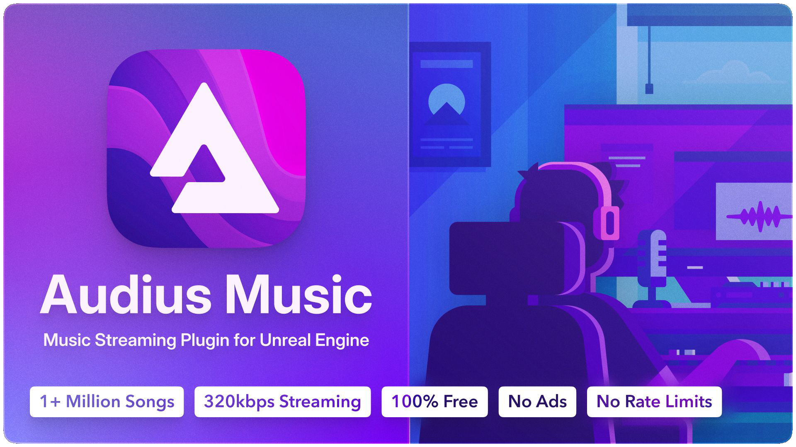

# Audius Unreal Engine Plugin 

The Audius API is entirely free to use. Audius asks that you adhere to the guidelines in this doc [https://audiusproject.github.io/api-docs/#audius-api-docs](https://audiusproject.github.io/api-docs/#audius-api-docs) and always credit artists.

# Marketplace Demo Project

This is just the First Person template project (blueprint version) with the Audius Plugin enabled in the scene.

## Supported Engine Versions

5.3

## Usage

Unzip and open "Audius_Demo.uproject"

## More Info

[https://github.com/DigiKrafting/Audius_Unreal_Plugin](https://github.com/DigiKrafting/Audius_Unreal_Plugin)